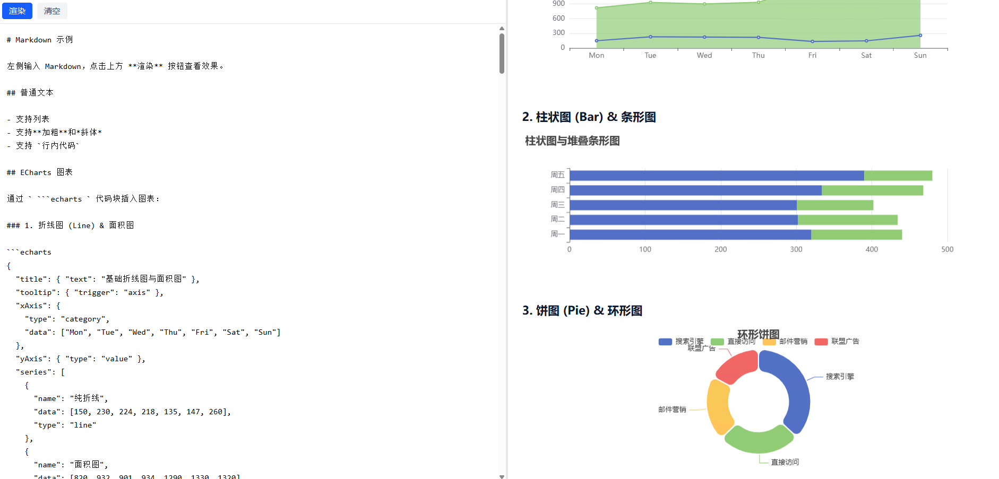

# Markdown 转换器

[English](./README.md) | 中文

基于 React + TypeScript + Tailwind CSS 的 Markdown 编辑与预览工具，支持通过 ` ```echarts ` 代码块嵌入 [ECharts](https://echarts.apache.org/zh/index.html) 图表。

## 功能特性

- 左右分栏的可拖动编辑与预览布局
- 手动触发渲染，避免输入时频繁刷新
- 直接通过 Markdown 代码块渲染 ECharts 图表
- 基于 Tailwind CSS 的简洁界面
- 包含 TypeScript 类型与单元测试

## 预览



> 将截图放入 `docs/preview.png` 即可在 README 中展示界面。

## 技术栈

- [Vite](https://vitejs.dev/) - 构建工具
- [React 19](https://react.dev/) - UI 库
- [TypeScript](https://www.typescriptlang.org/) - 类型安全
- [Tailwind CSS](https://tailwindcss.com/) - 样式
- [react-markdown](https://github.com/remarkjs/react-markdown) - Markdown 渲染
- [ECharts](https://echarts.apache.org/zh/index.html) - 图表
- [react-resizable-panels](https://github.com/bvaughn/react-resizable-panels) - 可拖动分栏
- [Vitest](https://vitest.dev/) - 测试

## 快速开始

### 环境要求

- Node.js 18+
- pnpm / npm / yarn

### 安装

```bash
npm install
```

### 开发

```bash
npm run dev
```

在浏览器中打开 http://localhost:5173。

### 构建

```bash
npm run build
```

### 测试

```bash
npm test
```

## 使用说明

在左侧编辑区输入 Markdown，点击**渲染**按钮后在右侧预览效果。

### 嵌入 ECharts 图表

使用语言为 `echarts` 的代码块：

````markdown
```echarts
{
  "title": { "text": "示例图表" },
  "xAxis": { "type": "category", "data": ["A", "B", "C"] },
  "yAxis": { "type": "value" },
  "series": [{ "type": "bar", "data": [1, 2, 3] }]
}
```
````

代码块内的 JSON 会直接作为 `echarts.setOption()` 的配置对象。

## 项目结构

```
src/
├── App.tsx                 # 应用根组件与状态
├── components/
│   ├── MarkdownEditor.tsx  # 左侧编辑区
│   ├── PreviewPanel.tsx    # 右侧预览区
│   ├── ResizablePanels.tsx # 分栏布局容器
│   └── EChartsBlock.tsx    # ECharts 自定义代码块
├── index.css
└── main.tsx
```

## 可用脚本

| 脚本 | 说明 |
|------|------|
| `npm run dev` | 启动开发服务器 |
| `npm run build` | 构建生产版本 |
| `npm run preview` | 预览生产构建 |
| `npm run lint` | 运行 ESLint |
| `npm test` | 运行 Vitest 测试 |

## 开源协议

[MIT](./LICENSE)
